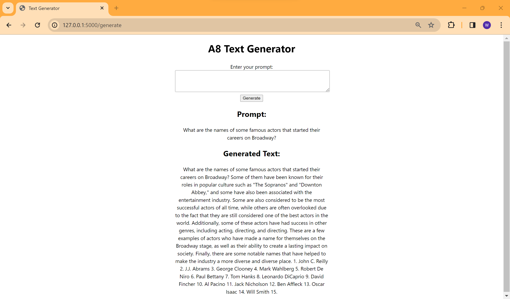

# NLP-2024-A8

# Student Information

Name : Wut Yee Aung - st124377

# Task1

Download the json file from the provided link and load by using "load_dataset('json', data_files=file_path)" which supports building a dataset from JSON files.

# Task2
Use "distilgpt2" model as pretrained model and SFTTrainer as trainer by parsing "distilgpt2" pretrained model, "alpaca data" as trained dataset, "tatsu-lab/alpaca_eval" as evaluation dataset. I use 1000 records among (52002) records for training data due to limitation of hardware resources but use all records (805) for evaluation.

# Task3
'eval_loss': 2.34,
'eval_runtime': 229.73,
'eval_samples_per_second': 3.504,
'eval_steps_per_second': 0.44,
'epoch': 3.0

# Task4
Users can type anything such as general question, dedicated topic, etc and model will reply by retrieve relevant documents from a dataset. Firstly input text is encoded according to pretrained tokenizer and parse to model for text generating which is output. Then decode the output text by tokenizer and return back to user.

Web app is running on localhost:5000

